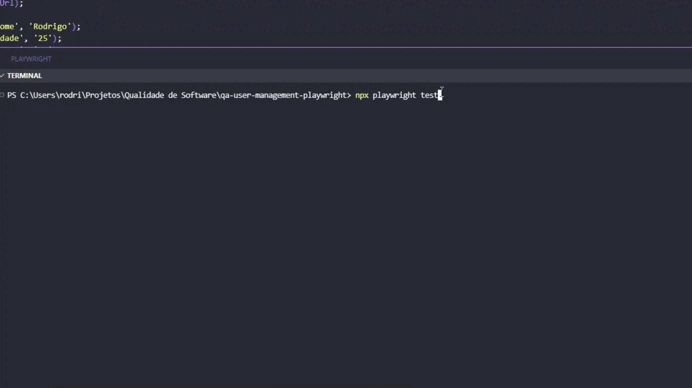
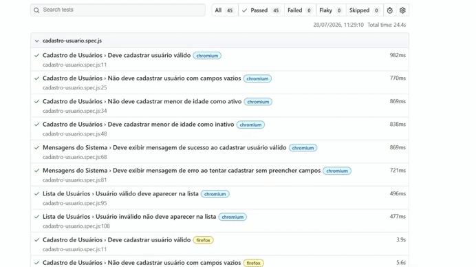
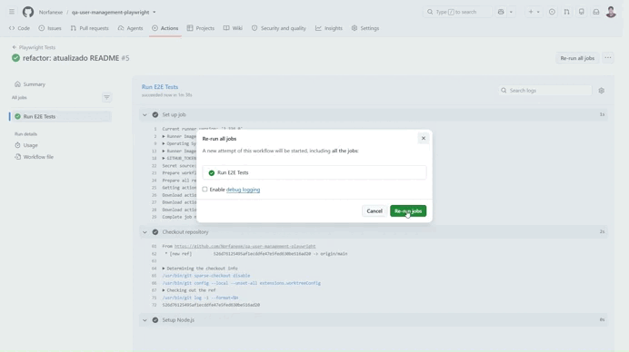

# QA User Management Playwright


Projeto de automação End-to-End desenvolvido com Playwright para validar uma aplicação de gerenciamento de usuários. O objetivo é demonstrar um fluxo completo de Engenharia de Qualidade, contemplando documentação funcional, automação cross-browser, integração contínua e execução automatizada de testes.

## 📑 Sumário

- [📋 Objetivo](#-objetivo)
- [⭐ Destaques do Projeto](#-destaques-do-projeto)
- [📁 Estrutura do Projeto](#-estrutura-do-projeto)
- [🏗️ Arquitetura do Projeto](#️-arquitetura-do-projeto)
- [🚀 Tecnologias Utilizadas](#-tecnologias-utilizadas)
- [🖥️ Ambiente de Teste](#️-ambiente-de-teste)
- [▶️ Como Executar](#️-como-executar)

  - [Instalar Dependências](#instalar-dependências)
  - [Executar Testes](#executar-testes)
  - [Executar Apenas Chromium](#executar-apenas-chromium)
  - [Abrir Relatório HTML](#abrir-relatório-html)

- [📖 Regras de Negócio](#-regras-de-negócio)
- [⚙️ Regras Funcionais](#️-regras-funcionais)

- [📚 Distribuição por User Story](#-distribuição-por-user-story)

  - [US-001 - Cadastrar Usuário](#us-001---cadastrar-usuário)
  - [US-002 - Editar Usuário](#us-002---editar-usuário)
  - [US-003 - Excluir Usuário](#us-003---excluir-usuário)
  - [US-004 - Pesquisar Usuário](#us-004---pesquisar-usuário)
  - [US-005 - Persistência de Dados](#us-005---persistência-de-dados)
  - [US-006 - Feedback ao Usuário](#us-006---feedback-ao-usuário)

- [📋 Casos de Teste](#-casos-de-teste)
- [🎯 Estratégia Adotada para os Casos de Teste](#-estratégia-adotada-para-os-casos-de-teste)

- [🧪 Cenários Automatizados](#-cenários-automatizados)

  - [Cadastro de Usuários](#cadastro-de-usuários)
  - [Editar Usuário](#editar-usuário)
  - [Excluir Usuário](#excluir-usuário)
  - [Pesquisar Usuário](#pesquisar-usuário)
  - [Persistência de Usuários](#persistência-de-usuários)
  - [Mensagens do Sistema](#mensagens-do-sistema)

- [📈 Métricas de Qualidade](#-métricas-de-qualidade)
- [📊 Resultado Atual](#-resultado-atual)
- [🔗 Matriz de Rastreabilidade](#-matriz-de-rastreabilidade)
- [📸 Evidências](#-evidências)
- [🔄 Integração Contínua (CI/CD)](#-integração-contínua-cicd)
- [✅ Conclusão](#-conclusão)
- [🙏 Agradecimentos](#-agradecimentos)
- [👨‍💻 Autor](#-autor)


---
## 📋 Objetivo

Projeto de automação End-to-End desenvolvido com Playwright para validar uma aplicação de gerenciamento de usuários. O repositório visa aplicar práticas de Engenharia de Qualidade, incluindo documentação funcional, automação cross-browser, integração contínua com GitHub Actions e artefatos de teste utilizados em ambientes profissionais.

A aplicação simula um sistema de cadastro de usuários contendo regras de negócio, validações funcionais e uma suíte automatizada executada em múltiplos navegadores.

O projeto foi estruturado seguindo práticas utilizadas em ambientes corporativos de QA, contemplando documentação funcional, casos de teste, automação, métricas e pipeline CI/CD.

---

<p align="center">
  
</p>

<p align="center">
  
</p>

---

## ⭐ Destaques do Projeto

- ✅ Aplicação web para gerenciamento de usuários desenvolvida em JavaScript
- ✅ Automação End-to-End utilizando Playwright
- ✅ Cobertura das principais regras de negócio com testes funcionais
- ✅ Execução Cross-Browser (Chromium, Firefox e WebKit)
- ✅ Pipeline CI/CD automatizada com GitHub Actions
- ✅ Documentação completa de QA (Plano de Testes, Casos de Teste e Bug Report)
- ✅ Relatórios HTML para análise das execuções automatizadas
- ✅ Estrutura organizada seguindo boas práticas de Engenharia de Qualidade

---
## 📁 Estrutura do Projeto

```text
qa-user-management-playwright
│
├── app
│   ├── index.html
│   ├── style.css
│   └── app.js
│
├── docs
│   ├── plano-de-testes.md
│   ├── casos-de-teste.md
│   └── exemplo-bug-report.md
│
├── evidencias
│   ├── cadastro-valido.png
│   ├── cadastro-invalido.png
│   ├── relatorio-playwright-chromium.png
│   ├── relatorio-playwright-firefox.png
│   └── relatorio-playwright-webkit.png
│
├── tests
│   └── cadastro-usuario.spec.js # Fluxos de cadastro e validações
│   └── editar-usuario.spec.js # Alteração de usuários cadastrados
│   └── excluir-usuario.spec.js  # Exclusão de usuários
│   └── persistencia.spec.js  # Persistência dos dados após recarregar a página
│   └── pesquisar-usuario.spec.js # Busca e filtragem de usuários
│   
├── .github
│   └── workflows
│       └── playwright.yml
│
├── playwright.config.js
├── package.json
├── package-lock.json
└── README.md

```
---

## 🏗️ Arquitetura do Projeto

O projeto foi organizado de forma modular para separar responsabilidades entre a aplicação, a automação de testes, a documentação e a integração contínua.

| Diretório | Responsabilidade |
|------------|------------------|
| `app/` | Aplicação web utilizada como alvo da automação de testes. |
| `tests/` | Suíte de testes automatizados organizada por funcionalidade. |
| `docs/` | Artefatos de QA, incluindo plano de testes, casos de teste e bug report. |
| `evidencias/` | GIFs, capturas de tela e relatórios gerados durante as execuções. |
| `.github/workflows/` | Pipeline de Integração Contínua utilizando GitHub Actions. |

---

## 🚀 Tecnologias Utilizadas

* JavaScript
* HTML5
* CSS3
* Node.js
* Playwright
* GitHub Actions (CI/CD)
* VS Code

---
## 🖥️ Ambiente de Teste

| Item                   | Descrição                  |
| ---------------------- | -------------------------- |
| Sistema Operacional    | Windows 11                 |
| Linguagem              | JavaScript (ES6)           |
| Framework de Automação | Playwright                 |
| Ambiente de Execução   | Local                      |
| Navegadores Validados  | Chromium, Firefox e WebKit |
| Gerenciador de Pacotes | NPM                        |
| Controle de Versão     | Git                        |
| Repositório            | GitHub                     |
| Integração Contínua    | GitHub Actions             |

---
## ▶️ Como Executar

### Instalar dependências

```bash
npm install
```

### Executar testes

```bash
npx playwright test
```

### Executar apenas Chromium

```bash
npx playwright test --project=chromium
```

### Abrir relatório HTML

```bash
npx playwright show-report
```
---
## 📖 Regras de Negócio

RN-001 Nome é obrigatório.

RN-002 Idade é obrigatória.

RN-003 Cargo é obrigatório.

RN-004 Usuários menores de 18 anos não podem ser cadastrados como Ativos.

## ⚙️ Regras Funcionais

RF-001 O sistema deve permitir cadastrar usuários válidos.

RF-002 O sistema deve impedir o cadastro quando houver campos obrigatórios não preenchidos.

RF-003 O sistema deve impedir o cadastro de usuários menores de 18 anos com status "Ativo".

RF-004 O sistema deve permitir cadastrar usuários menores de idade com status "Inativo".

RF-005 O sistema deve permitir editar usuários previamente cadastrados.

RF-006 O sistema deve permitir excluir usuários cadastrados.

RF-007 O sistema deve permitir pesquisar usuários pelo nome.

RF-008 O sistema deve exibir somente os usuários correspondentes ao filtro informado.

RF-009 O sistema deve manter os dados cadastrados após atualização da página.

RF-010 O sistema deve manter alterações realizadas após atualização da página.

RF-011 O sistema deve manter exclusões realizadas após atualização da página.

RF-012 O sistema deve apresentar mensagens de sucesso para operações concluídas.

RF-013 O sistema deve apresentar mensagens de erro quando ocorrerem falhas de validação.

---

## 📚 Distribuição por User Story

### US-001 - Cadastrar Usuário

**Como** operador do sistema

**Quero** cadastrar usuários

**Para** disponibilizá-los para gerenciamento na aplicação.

#### Cenários Relacionados

- CT-001
- CT-002
- CT-003
- CT-004

---

### US-002 - Editar Usuário

**Como** operador do sistema

**Quero** editar usuários cadastrados

**Para** manter suas informações atualizadas.

#### Cenários Relacionados

- CT-005

---

### US-003 - Excluir Usuário

**Como** operador do sistema

**Quero** excluir usuários cadastrados

**Para** remover registros que não são mais necessários.

#### Cenários Relacionados

- CT-006

---

### US-004 - Pesquisar Usuário

**Como** operador do sistema

**Quero** pesquisar usuários cadastrados

**Para** localizar rapidamente registros específicos.

#### Cenários Relacionados

- CT-007
- CT-008

---

### US-005 - Persistência de Dados

**Como** operador do sistema

**Quero** que os dados permaneçam armazenados

**Para** garantir a integridade das informações após atualizar a aplicação.

#### Cenários Relacionados

- CT-009
- CT-010
- CT-011

---

### US-006 - Feedback ao Usuário

**Como** operador do sistema

**Quero** receber mensagens claras sobre minhas ações

**Para** confirmar se as operações foram executadas com sucesso ou apresentaram erros.

#### Cenários Relacionados

- CT-012
- CT-013
 
---
## 📋 Casos de Teste

Os casos de teste detalhados estão documentados em:

```text
docs/casos-de-teste.md
```

| ID     | Cenário                                                  |
| ------ | -------------------------------------------------------- |
| CT-001 | Cadastrar usuário válido                                 |
| CT-002 | Não cadastrar usuário com campos obrigatórios vazios     |
| CT-003 | Não cadastrar menor de idade como ativo                  |
| CT-004 | Cadastrar menor de idade como inativo                    |
| CT-005 | Editar usuário cadastrado                                |
| CT-006 | Excluir usuário cadastrado                               |
| CT-007 | Pesquisar usuário existente                              |
| CT-008 | Pesquisar usuário inexistente                            |
| CT-009 | Manter usuário cadastrado após atualizar a página        |
| CT-010 | Manter usuário editado após atualizar a página           |
| CT-011 | Manter usuário excluído após atualizar a página          |
| CT-012 | Exibir mensagem de sucesso após cadastro válido          |
| CT-013 | Exibir mensagem de erro ao cadastrar com dados inválidos |


---
## 🎯 Estratégia Adotada para os Casos de Teste

A estratégia de testes foi baseada na validação dos principais fluxos de gerenciamento de usuários, contemplando operações de cadastro, edição, exclusão, pesquisa e persistência dos dados. Foram priorizados cenários positivos e negativos, regras críticas de negócio, validações funcionais, mensagens ao usuário e comportamento da aplicação após recarregamento da página.

Foram adotadas as seguintes abordagens:

* Testes Positivos (fluxos válidos)
* Testes Negativos (validação de bloqueios e erros)
* Testes Funcionais
* Testes End-to-End (E2E)
* Testes de Regressão
* Testes Cross-Browser

A cobertura foi construída considerando:

* Entradas válidas
* Entradas inválidas
* Campos obrigatórios
* Restrições de idade
* Mensagens exibidas ao usuário
* Integridade da listagem de usuários

---
## 🧪 Cenários Automatizados

### Cadastro de Usuários

- ✅ CT-001 | Deve cadastrar usuário válido
- ✅ CT-002 | Não deve cadastrar usuário com campos vazios
- ✅ CT-003 | Não deve cadastrar menor de idade como ativo
- ✅ CT-004 | Deve cadastrar menor de idade como inativo

### Editar Usuário

- ✅ CT-005 | Deve editar usuário válido

### Excluir Usuário

- ✅ CT-006 | Deve excluir usuário cadastrado

### Pesquisar Usuário

- ✅ CT-007 | Deve pesquisar usuário existente
- ✅ CT-008 | Deve exibir mensagem ao pesquisar usuário inexistente

### Persistência de Usuários

- ✅ CT-009 | Deve manter usuário cadastrado após atualizar a página
- ✅ CT-010 | Deve manter usuário editado após atualizar a página
- ✅ CT-011 | Deve manter usuário excluído após atualizar a página

### Mensagens do Sistema

- ✅ CT-012 | Deve exibir mensagem de sucesso ao cadastrar usuário válido
- ✅ CT-013 | Deve exibir mensagem de erro ao tentar cadastrar sem preencher campos

---
## 📈 Métricas de Qualidade

| Métrica             | Valor                                               |
| ------------------- | --------------------------------------------------- |
| Framework           | Playwright                                          |
| Navegadores         | Chromium, Firefox e WebKit                          |
| Status da suíte     | ✅ Todos os testes aprovados                         |
| Integração Contínua | GitHub Actions                                      |
| Cobertura           | Cadastro, edição, exclusão, pesquisa e persistência |


---
## 📊 Resultado Atual

45 testes executados

45 testes aprovados

0 falhas

100% de sucesso

Tempo de execução: 34,4 s

---

## 🔗 Matriz de Rastreabilidade

| RN | RF | US | CT | Automação |
|----|----|----|----|-----------|
| RN-001 | RF-001 | US-001 | CT-001 | ✅ |
| RN-001, RN-002, RN-003 | RF-002 | US-001 | CT-002 | ✅ |
| RN-004 | RF-003 | US-001 | CT-003 | ✅ |
| RN-004 | RF-004 | US-001 | CT-004 | ✅ |
| — | RF-005 | US-002 | CT-005 | ✅ |
| — | RF-006 | US-003 | CT-006 | ✅ |
| — | RF-007, RF-008 | US-004 | CT-007, CT-008 | ✅ |
| — | RF-009, RF-010, RF-011 | US-005 | CT-009, CT-010, CT-011 | ✅ |
| — | RF-012, RF-013 | US-006 | CT-012, CT-013 | ✅ |

## 📸 Evidências

O projeto possui evidências das execuções realizadas durante os testes automatizados.

### Evidências Disponíveis

- Cadastro válido
- Cadastro inválido
- Relatório Chromium
- Relatório Firefox
- Relatório WebKit

Localização:

```text
evidencias/
```

---
## 🔄 Integração Contínua (CI/CD)

O projeto possui pipeline automatizada através do GitHub Actions.

A cada push realizado na branch principal, o workflow executa automaticamente, conforme exemplo abaixo:

- Instalação das dependências
- Instalação dos navegadores Playwright
- Execução da suíte automatizada
- Geração de artefatos
- Publicação dos resultados da execução

<p align="center">
  
</p>

---
### Status Atual

✅ Pipeline operacional

✅ GitHub Actions configurado

✅ Execução automatizada dos testes

✅ Integração contínua validada

✅ Relatórios gerados automaticamente

---
## ✅ Conclusão

O projeto atingiu com sucesso os objetivos propostos para a primeira fase de desenvolvimento e automação.

Foram implementadas regras de negócio, documentação de QA, automação E2E utilizando Playwright, execução Cross-Browser e integração contínua através do GitHub Actions.

A suíte automatizada demonstrou estabilidade durante as execuções realizadas, obtendo 100% de sucesso nos cenários planejados.

Este projeto representa uma base sólida para evolução futura envolvendo testes de API, persistência de dados, métricas avançadas e expansão da cobertura automatizada.

---
## 🙏 Agradecimentos

Agradeço a todos os profissionais da comunidade de Qualidade de Software e Automação de Testes que compartilham conhecimento e contribuem para o crescimento contínuo da área.E principalmente à dedicação contínua ao aprendizado, prática e evolução profissional em Qualidade de Software.

---
## 👨‍💻 Autor

Rodrigo Pereira Costa

QA Analyst | Quality Assurance | Automação de Testes

### LinkedIn

https://www.linkedin.com/in/rodrigo-pereira-049465179/

### GitHub

https://github.com/Norfanexe